# JPA N+1 문제에 대한 고찰
JPA를 사용하다가 맞닥드린 N+1에 대해서 정리한 코드

## ERD

## Class Diagram
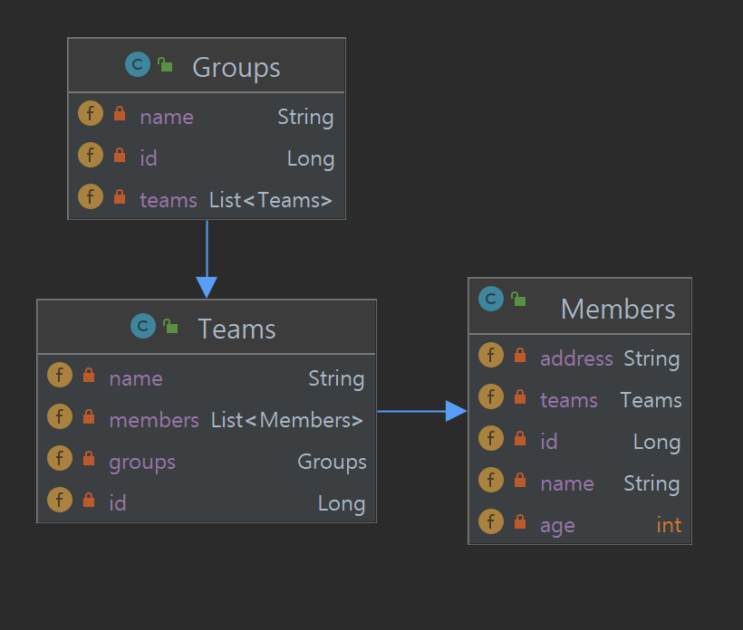

## 구동 화면

| Test1 Method Log                  |
|-----------------------------------|
| 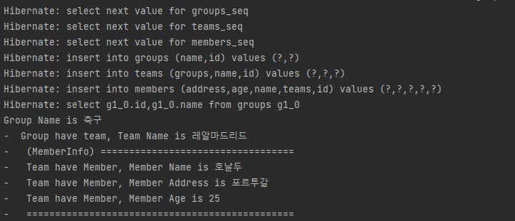               |

| Test2 Method Log                  |
|-----------------------------------|
| 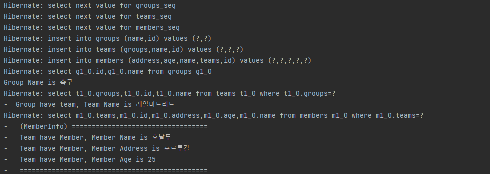               |

| Test3 Method Log                  |
|-----------------------------------|
| 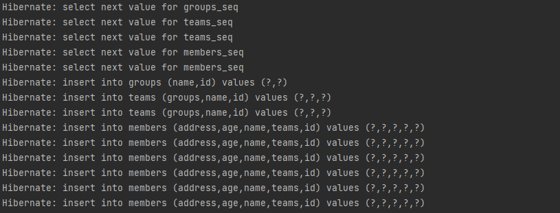             |
| 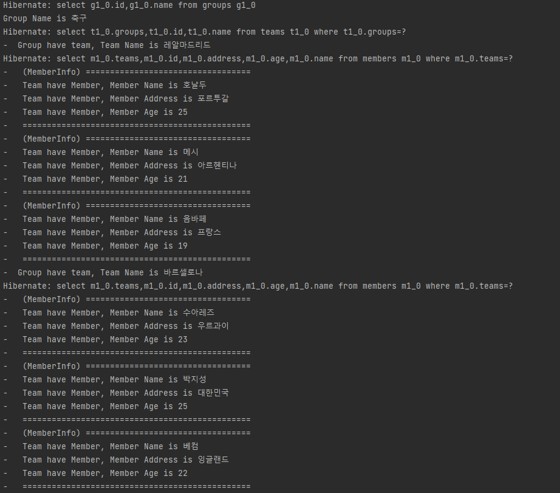             |

| Test4 Method Log                  |
|-----------------------------------|
| 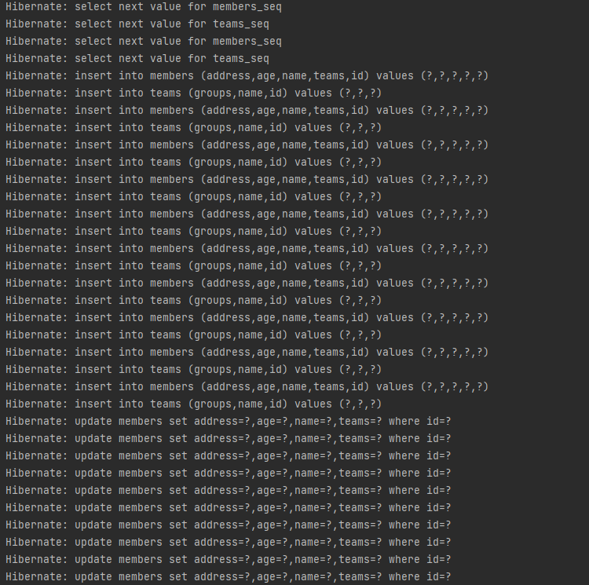             |
| 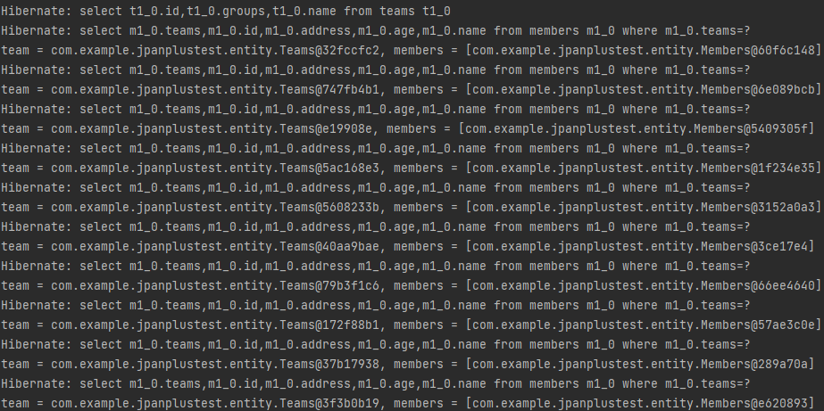             |

| Test5 Method Log                  |
|-----------------------------------|
| 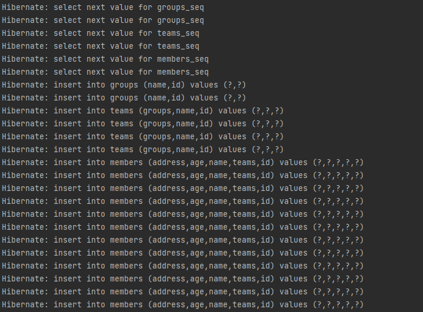             |
| 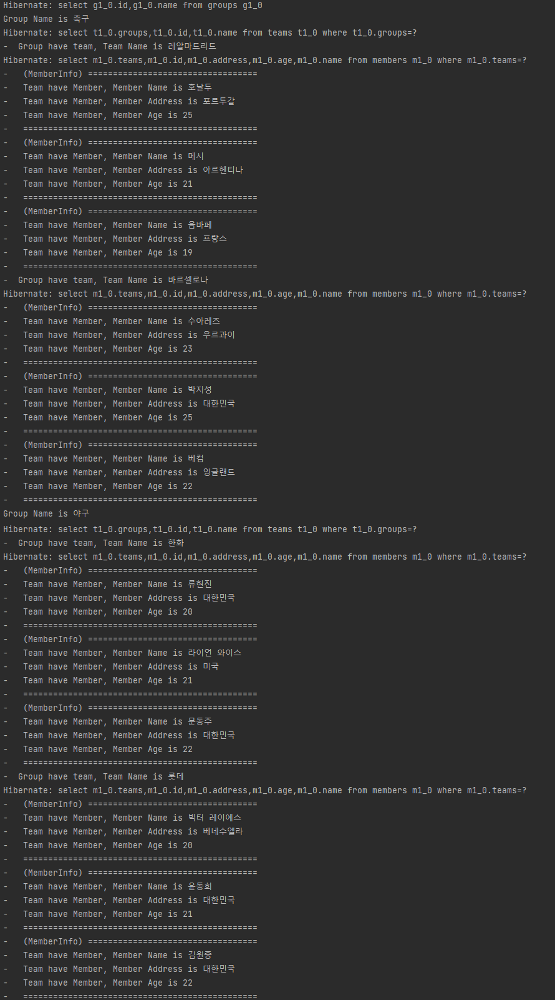             |

| Test6 Method Log                  |
|-----------------------------------|
|              |
| 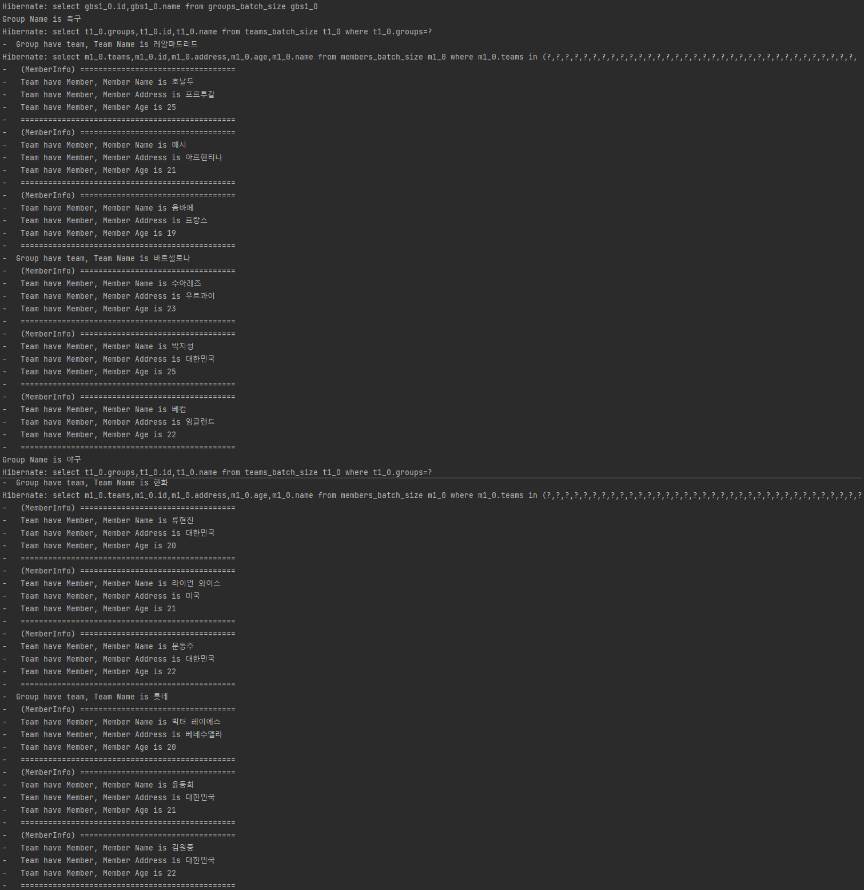             |

| Test7 Method Log                  |
|-----------------------------------|
| 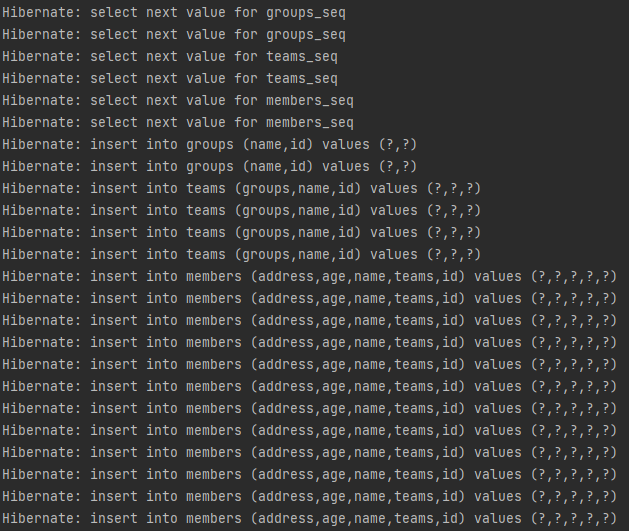             |
| 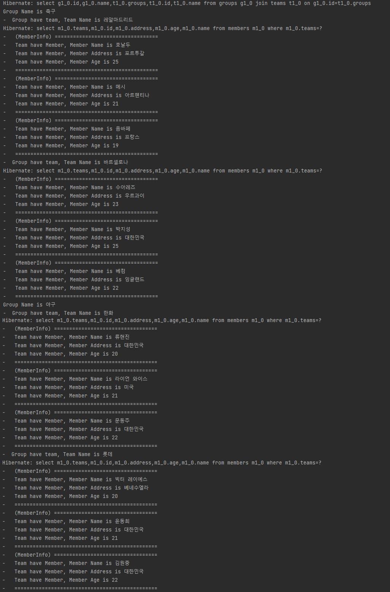             |

| Test8 Method Log                  |
|-----------------------------------|
| 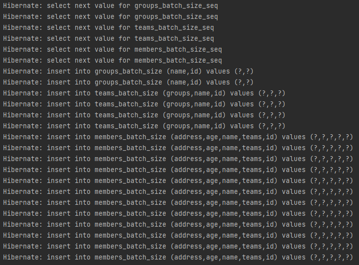             |
| 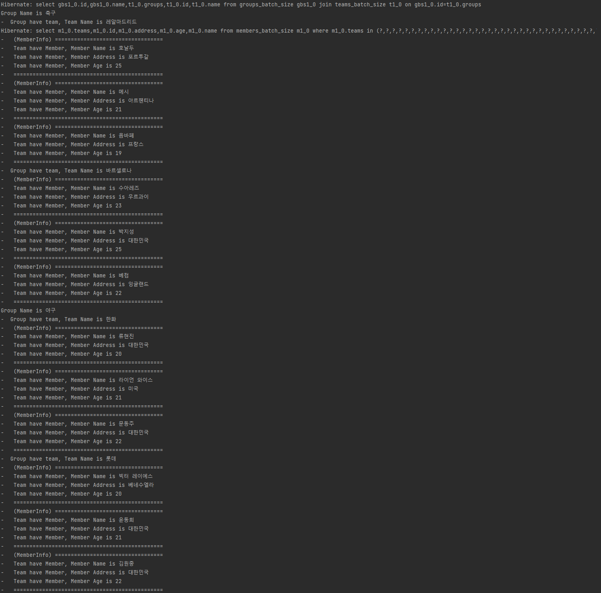             |